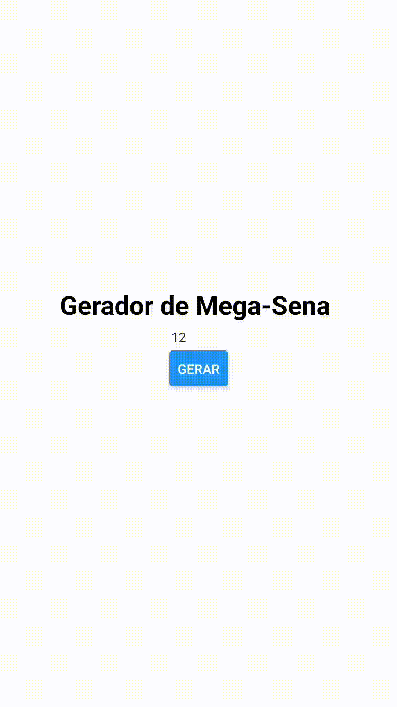

# Mega Sena - ReactNative (mini project) 

Mini projeto gerador de números aleatórios, estilo Mega-Sena, desenvolvido em React Native  para fins de prática, fixação de conceitos e aprimoramento da lógica.
O código encontra-se comentado para programadores mais iniciantes possam compreender a lógica implementada e alguns paradgmas utilizados.

## 📁 Acesso ao projeto
**Para executar esse projeto é necessário instalar algumas dependências. Siga: [Instalação Expo](https://docs.expo.dev/get-started/installation/)**
Você pode clonar este repositório através de seu terminal ou baixá-lo aqui mesmo.

## 🛠️ Abrir e rodar o projeto
- Abrir seu editor de código
- Solicite para abrir o arquivo 
- Procure o local onde o projeto está e o selecione (Caso o projeto seja baixado via .zip, é necessário extraí-lo antes de procurá-lo)
- Clique em Abrir
- Para rodar o App execute o terminal e rode:
`expo start` ou `yarn start`

## Stack de aprendizado
   

## License

MIT

**Use para fins de aprendizado e prática**
